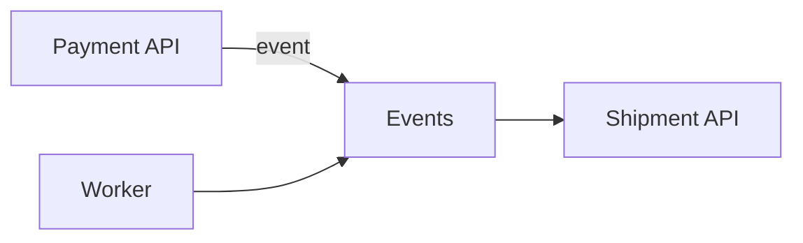

### Business logic

Triggering shipment api decoupled from invoices web hook.


Payment API --[event]--> Events 
                            ^    
                            |
                        ShipmentJob -------> Shipment API
                            ^
                            |
                         Worker




### API
/api/shippment-mock/ok
/api/shippment-mock/failure
/api/shippment-mock/timeout
###
```bash
docker compose up -d
```
